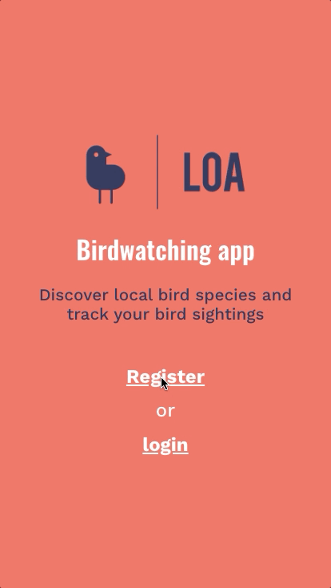

# Loa - Birdwatching app 🦉

<!-- ## Live at:

https://loa-birds.herokuapp.com
-->

## Overview

Loa is a map-based SPA allowing users to view & search recent bird sightings in their area (API data) as well as add/delete their own bird sightings, with optional photos & comments.

📱 🖥 Optimized for both mobile & desktop.
On mobile, best viewed in portrait mode.

❓ I love spending time in nature, but know nothing about birds, so I wanted to build an app that can help me (and others) learn more about birds and come in handy for birdwatching.
Loa started as my final project in the full stack bootcamp at Spiced Academy and I continued to improve it after graduating.

## Features

-   Map-based view with two distinctive layers of data:

    -   bird sightings in the past 30 days on a 50-km radius around user location (if user rejected geolocation, default location is center of Berlin) - data via eBird API, converted to GeoJSON before map rendering
    -   bird sightings of the logged-in user, stored as GeoJSON in a back-end database

-   Geolocation

-   Users can click on the map pins to see more information such as the bird's common and scientific name, photos of the bird (via Wikipedia API or, if available, photos taken by the user) and a link to the bird's page on Wikipedia.

-   Comprehensive bird data: the app is powered by a list of 300+ birds available in Germany complete with creative-commons photos and Wikipedia links (data scraped from bird websites & via Wikipedia API, and consolidated for consistency)

-   Search function:

    -   users can search through all birds visible on the map (pre-populated search list that updates dynamically based on user interaction with the map)
    -   the map re-centers on the pin(s) that match the user search

-   Users can manage their own bird sightings:

    -   add new bird sightings
    -   optional: add a comment to a new sighting
    -   optional: upload one or more images for a new sighting (with client and server-side image validation)
    -   delete their own pins (including deletion of images associated with the pin on AWS S3)

-   Users can
    -   authenticate/login (with client and server-side validation)
    -   logout

## Technology

-   Javascript
-   React & Redux
-   Mapbox
-   Node.js & Express
-   PostgreSQL
-   AWS S3
-   Heroku

## Set up this project locally

-   you need to own an AWS account with an S3 Bucket and pass AWS credentials so the image uploading/deleting middleware works
-   you need to own a key for the eBird API
-   set up a PSQL database as described in the `birdapp.sql` file in this repo
-   clone the repository
-   install all the dependencies with `npm install`
-   run the project locally with `npm run dev` and open it at `localhost:3000`

## Previews

### Interacting with map pins

 

### Adding a new user sighting

 

### Deleting a pin + logout

 

### Search function

 

### Login and map load with geolocation off

 

### Login new user and map load with geolocation on

 

### Registration screen with form validation

 
